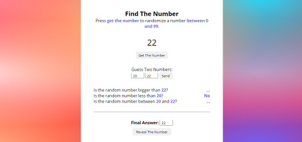

# Find The Number Game

I thought of this game when I was learning about math properties: how cool would it be if there was a simple 'guess the number' game and we could generate as many numbers as we want and play as many time as we want? Of course, we would also have some clues so we wouldn't go mad trying to think of numbers randomly.  
[Live Preview](https://findthenumber-game.netlify.app/)

## The Concept

I tried to make it as simple as I could just so I wouldn't lose myself in the project. Now that it's up, I want to make improvements as I'm learning new things. Please feel free to try it out and let me know what you think and what I could do to make this game an even better experience!

## Made With

HTML5, CSS3 & Javascript.
